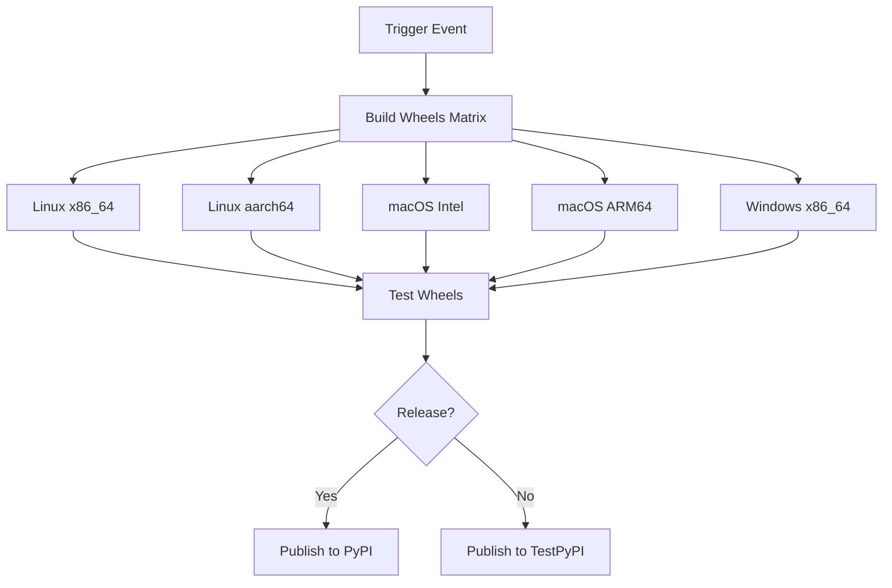

# PyGROG Installation and Distribution Guide

This document explains how PyGROG handles installation, precompiled binaries, and CI/CD.

## Installation Methods

### 1. From PyPI (Recommended)
```bash
pip install pygrog
```

This will:
- **First try**: Download a precompiled wheel for your platform (OS + architecture)
- **Fallback**: Build from source if no compatible wheel is available
- **Final fallback**: Install pure Python version if compilation fails

### 2. From Source (Development)
```bash
# Clone repository
git clone https://github.com/FiRMLAB-Pisa/pygrog.git
cd pygrog

# Development install
pip install -e .

# Or using CMake build script
./build_cmake.sh
```

### 3. Force Pure Python (No C++ Extension)
```bash
PYGROG_PURE_PYTHON=1 pip install pygrog
```

## Precompiled Wheel Support

### Supported Platforms
| OS      | Architecture | Python Versions | SIMD Support |
|---------|-------------|----------------|--------------|
| Linux   | x86_64      | 3.10, 3.11, 3.12 | AVX-512, AVX2, SSE |
| Linux   | aarch64     | 3.10, 3.11, 3.12 | NEON |
| macOS   | x86_64      | 3.10, 3.11, 3.12 | AVX2, SSE |
| macOS   | arm64       | 3.10, 3.11, 3.12 | NEON |
| Windows | x86_64      | 3.10, 3.11, 3.12 | AVX2, SSE |

### Wheel Naming Convention
```
pygrog-1.0.0-cp311-cp311-linux_x86_64.whl
pygrog-1.0.0-cp311-cp311-macosx_10_15_x86_64.whl
pygrog-1.0.0-cp311-cp311-win_amd64.whl
```

## CI/CD Pipeline

### GitHub Actions Workflow

#### 1. Build Wheels (`.github/workflows/wheels.yml`)
Triggered on:
- Push to `main` branch
- Pull requests
- New releases
- Manual dispatch

**Process:**


#### 2. Test Local Build (`.github/workflows/test_build.yml`)
Tests local compilation on all platforms to ensure source distribution works.

### Build Matrix
```yaml
strategy:
  matrix:
    include:
      - os: ubuntu-latest
        arch: x86_64
        build: "cp310-* cp311-* cp312-*"
      - os: ubuntu-latest  
        arch: aarch64
        build: "cp310-* cp311-* cp312-*"
      - os: macos-13      # Intel
        arch: x86_64
        build: "cp310-* cp311-* cp312-*"
      - os: macos-14      # ARM64
        arch: arm64
        build: "cp310-* cp311-* cp312-*"
      - os: windows-latest
        arch: AMD64
        build: "cp310-* cp311-* cp312-*"
```

## Performance Optimization

### SIMD Instruction Sets
The build system automatically detects and enables:

**x86_64 platforms:**
- AVX-512F: 8 complex operations per instruction
- AVX2: 4 complex operations per instruction  
- SSE4.2: 2 complex operations per instruction
- Scalar: Fallback implementation

**ARM platforms:**
- NEON: 4 complex operations per instruction
- Scalar: Fallback implementation

### Build Optimization Flags

**Linux/macOS (GCC/Clang):**
```cmake
-O3 -march=native -mavx2 -mfma -fopenmp-simd -flto
```

**Windows (MSVC):**
```cmake
/O2 /arch:AVX2 /Oi /Ot /Oy /GL /LTCG
```

## Local Development

### Setup Development Environment
```bash
# Install build dependencies
pip install cmake ninja pybind11 scikit-build-core[pyproject]

# Clone and build
git clone https://github.com/FiRMLAB-Pisa/pygrog.git
cd pygrog
pip install -e .

# Test installation
python -c "from pygrog.operator import detect_simd_level; print(detect_simd_level())"
```

### Build Scripts
```bash
# Automated CMake build
./build_cmake.sh [--debug|--release] [--clean] [--verbose]

# Test PyPI workflow
./test_pypi_workflow.sh

# Legacy setuptools build
./build_extension.sh
```

### Testing Different Scenarios
```bash
# Test precompiled wheel installation
pip install --find-links wheelhouse pygrog

# Test source installation
pip install --no-binary pygrog pygrog

# Test pure Python fallback
PYGROG_PURE_PYTHON=1 pip install .
```

## Distribution Workflow

### 1. Development Cycle
```bash
# Make changes
edit src/pygrog/operator/_fast_binning.py
edit csrc/cpu/fast_binning_cpu.h

# Test locally
pip install -e .
python examples/fast_binning_example.py
python -m pytest tests/

# Push changes
git commit -am "Improve fast binning performance"
git push origin feature-branch
```

### 2. Release Process
```bash
# Create release
git tag v1.0.0
git push origin v1.0.0

# GitHub Actions will:
# 1. Build wheels for all platforms
# 2. Test wheels
# 3. Publish to PyPI
```

### 3. User Installation
```bash
# Users install with
pip install pygrog

# pip will:
# 1. Check for compatible wheel on PyPI
# 2. Download and install wheel if available
# 3. Build from source if no wheel found
# 4. Use pure Python if build fails
```

## Troubleshooting

### Common Installation Issues

#### No Precompiled Wheel Available
```
Building wheel for pygrog (pyproject.toml) ... done
```
This means no compatible wheel was found and pip is building from source.

#### Build Failure
```
error: Failed building wheel for pygrog
```
Solutions:
1. Install build dependencies: `pip install cmake pybind11`
2. Force pure Python: `PYGROG_PURE_PYTHON=1 pip install pygrog`
3. Use older version: `pip install pygrog==1.0.0`

#### Missing SIMD Performance
```python
from pygrog.operator import detect_simd_level
print(detect_simd_level())  # Should show AVX512/AVX/SSE, not Scalar
```

If showing "Scalar" or "Unavailable":
1. Check if C++ extension built: `python -c "import pygrog.operator._fast_binning"`
2. Rebuild with optimizations: `pip install --force-reinstall --no-binary pygrog pygrog`

### Verification Commands
```bash
# Check installation type
python -c "
try:
    import pygrog.operator._fast_binning
    print('✓ C++ extension available')
except ImportError:
    print('✗ Pure Python fallback')
"

# Performance test
python -c "
from pygrog.operator import benchmark_binning
results = benchmark_binning(n_points=10000, num_runs=3)
print(f'Speedup: {results.get(\"speedup\", \"N/A\")}x')
"

# SIMD detection
python -c "
from pygrog.operator import detect_simd_level
print(f'SIMD level: {detect_simd_level()}')
"
```

## Platform-Specific Notes

### Linux
- Uses `manylinux2014` for maximum compatibility
- Static linking of C++ runtime
- Supports both glibc and musl (Alpine)

### macOS
- Universal wheels for Intel and Apple Silicon
- Deployment target: macOS 10.15+
- Code signing for distribution

### Windows
- MSVC runtime statically linked
- Support for Windows 10+
- Both x86_64 and potentially x86 (32-bit)

## Performance Expectations

| System | SIMD | Expected Speedup |
|--------|------|------------------|
| Modern Intel/AMD | AVX-512 | 4-8x |
| Intel/AMD | AVX2 | 2-4x |
| Older x86_64 | SSE4.2 | 1.5-2x |
| Apple M1/M2 | NEON | 2-4x |
| ARM64 Linux | NEON | 2-4x |
| Pure Python | None | 1x (baseline) |

Actual performance depends on:
- Data size (larger = better speedup)
- Memory layout (C-contiguous = faster)
- System memory bandwidth
- Compiler optimizations