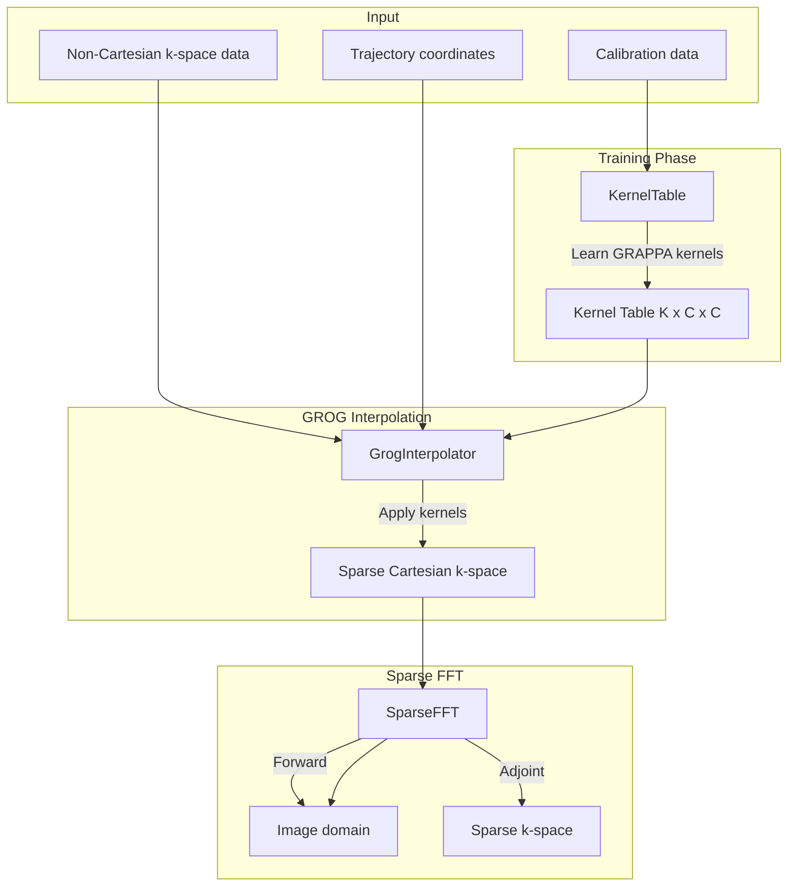
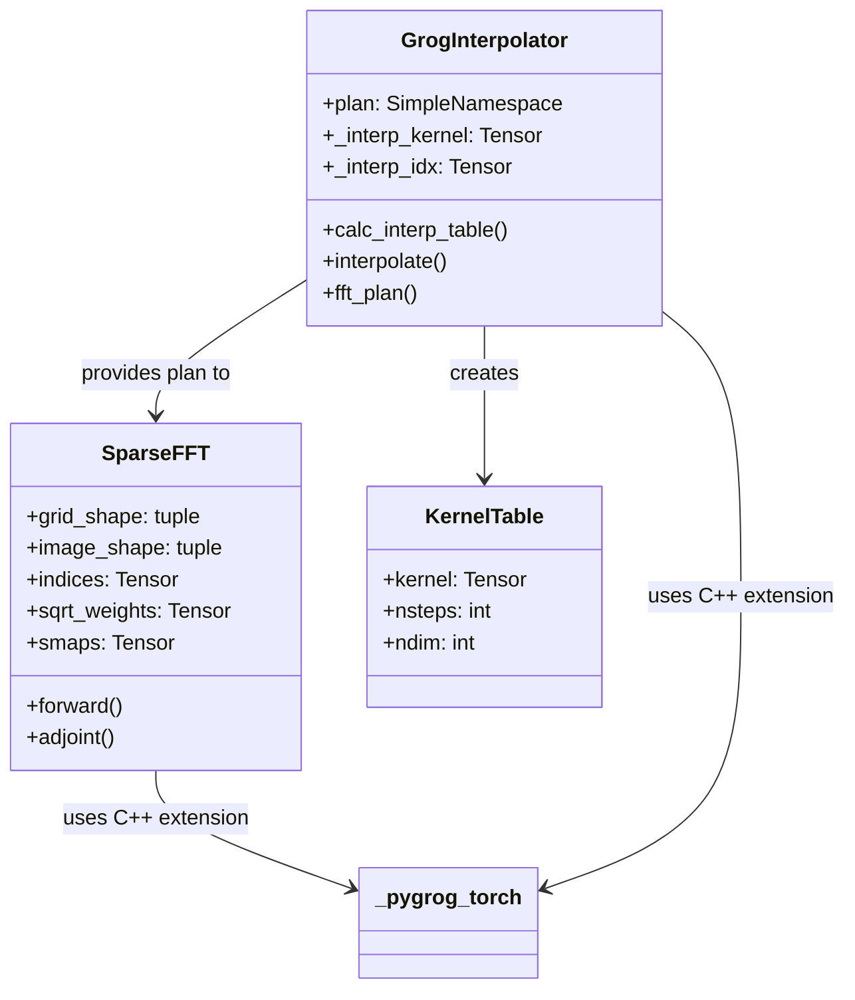
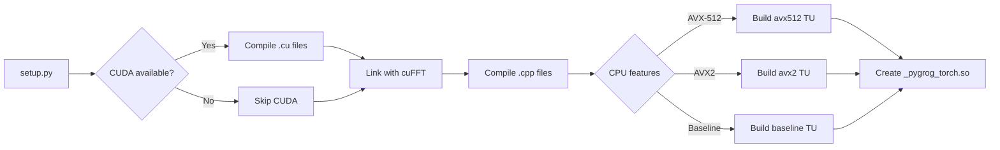

# PyGROG Project Audit

## Executive Summary

PyGROG is a high-performance GPU-accelerated library for non-Cartesian MRI reconstruction using the **GROG (GRAPPA Operator on a Grid)** interpolation method. The project provides a PyTorch-based implementation that combines data-driven GRAPPA kernel learning with efficient sparse FFT operations for accelerated MRI image reconstruction.

---

## Table of Contents

1. [Project Overview](#project-overview)
2. [Architecture](#architecture)
3. [Core Components](#core-components)
4. [C++/CUDA Kernel Implementations](#cpacuda-kernel-implementations)
5. [Python-Level Operators](#python-level-operators)
6. [Performance Characteristics](#performance-characteristics)
7. [Build System](#build-system)
8. [Dependencies](#dependencies)
9. [Recommendations](#recommendations)

---

## Project Overview

### Purpose
PyGROG addresses the challenge of reconstructing images from non-Cartesian k-space trajectories (spiral, radial, etc.) in MRI by:
1. Learning GRAPPA kernels from calibration data
2. Applying these kernels to interpolate non-Cartesian samples onto a sparse Cartesian grid
3. Using efficient sparse FFT operations to complete the reconstruction

### Key Features
- **Data-driven interpolation**: Learns optimal GRAPPA kernels from calibration data
- **GPU acceleration**: Custom CUDA kernels for interpolation and sparse operations
- **Multi-version CPU support**: AVX2, AVX-512, and baseline implementations with runtime dispatch
- **Memory-efficient**: Coil-by-coil processing with reusable buffers
- **Dual-stream pipelining**: Overlaps CPU-GPU transfers with computation

---

## Architecture

### High-Level Architecture Diagram



### Component Relationships



---

## Core Components

### 1. GrogInterpolator ([`src/pygrog/calib/_grog.py`](src/pygrog/calib/_grog.py:109))

The main interpolation class that:
- Creates interpolation plans from trajectory coordinates
- Computes GRAPPA kernels from calibration data
- Applies learned kernels to interpolate non-Cartesian samples

**Key Methods:**
- `__init__()`: Creates interpolation plan with target indices and weights
- `calc_interp_table()`: Learns GRAPPA kernels from calibration data
- `interpolate()`: Applies interpolation to data
- `fft_plan()`: Returns plan for SparseFFT consumption

**Plan Structure:**
```python
plan = SimpleNamespace(
    shape=(nz, ny, nx),           # Target image shape
    oversamp=(oz, oy, ox),        # Oversampling factors
    grid_shape=(nz*oz, ny*oy, nx*ox),  # Oversampled grid
    target_idx=(..., npts, kw),   # Target grid indices per source point
    weights=(..., npts, kw),      # Interpolation weights
    distances=(..., npts, kw, ndim),  # Distances for kernel selection
    radius=1.0,                   # Kernel radius
    n_samples=...,                # Total interpolated samples
)
```

### 2. SparseFFT ([`src/pygrog/operator/_sparse_fft.py`](src/pygrog/operator/_sparse_fft.py:185))

Efficient sparse FFT operator for non-Cartesian reconstruction:

**Forward (Adjoint NUFFT):** Sparse k-space → Image
1. Scatter weighted samples onto oversampled grid
2. IFFT to image domain
3. Center-crop to target resolution
4. Coil combination (sensitivity maps or RSS)

**Adjoint (Forward NUFFT):** Image → Sparse k-space
1. Multiply by sensitivity maps (if provided)
2. FFT to k-space
3. Zero-pad to oversampled grid
4. Gather at non-Cartesian locations

**Key Features:**
- Pre-computed sorted indices and permutation arrays
- Reusable grid buffers to minimize allocations
- Dual-stream GPU pipelining for CPU→GPU workflows
- Batch processing support for ORC/subspace applications

### 3. KernelTable ([`src/pygrog/calib/_grappa.py`](src/pygrog/calib/_grappa.py:1))

Computes GRAPPA kernels from calibration data:
- Quantizes distances to create discrete kernel bins
- Solves regularized least-squares for each bin
- Returns kernel table indexed by distance

---

## C++/CUDA Kernel Implementations

### Extension Module ([`csrc/torch/module.cpp`](csrc/torch/module.cpp))

The `_pygrog_torch` extension exposes:
- `grog_interp()`: Main GROG interpolation kernel
- `scatter_add()`: Weighted scatter-add to grid
- `scatter_add_binned()`: Binned scatter-add (GPU only)
- `gather()`: Gather from grid at indices

### CPU Implementations

#### Architecture Dispatch ([`csrc/torch/sparse_ops.cpp`](csrc/torch/sparse_ops.cpp))

```cpp
// Runtime dispatch based on CPU capabilities
if (has_avx512) {
    return sparse_ops_avx512::scatter_add_impl(...);
} else if (has_avx2) {
    return sparse_ops_avx2::scatter_add_impl(...);
} else {
    return sparse_ops_baseline::scatter_add_impl(...);
}
```

#### Common Implementation ([`csrc/torch/sparse_ops_cpu_impl.inl`](csrc/torch/sparse_ops_cpu_impl.inl))

**scatter_add (CPU):**
- Assumes **sorted indices** for clean thread partitioning
- Partitions work at index boundaries (no synchronization needed)
- Uses OpenMP for multi-threading
- Auto-vectorizes via compiler (AVX2/AVX-512)

**gather (CPU):**
- Embarrassingly parallel
- Sequential memory access pattern (prefetch-friendly)
- No synchronization required

### GPU Implementations ([`csrc/torch/sparse_ops_cuda.cu`](csrc/torch/sparse_ops_cuda.cu))

#### scatter_add_binned_kernel

**Strategy:** Bin-based reduction with natural load balancing

```
1. Each threadblock processes one bin of grid cells
2. Points are pre-sorted by grid index → contiguous slice per bin
3. Scatter to shared memory (atomics in shared ~5x faster)
4. Write aggregated bin to global memory (no atomics, bins are disjoint)
```

**Load Balancing:**
- **Natural load balancing**: Bins with many points (density hotspots like k-space center in radial trajectories) keep threadblocks busy
- **Empty bins exit immediately**: No wasted computation
- **Pre-sorted indices**: `bin_starts[b]` to `bin_starts[b+1]` defines each bin's point range
- **Handles non-uniform density**: Critical for radial/spiral trajectories where center is oversampled

**Performance Characteristics:**
- Shared memory size: `bin_size * 2 * sizeof(float)` (complex = 2 floats)
- Default bin_size: 256 grid cells
- Reduces global atomic operations by factor of `grid_size / bin_size`
- Dramatically reduces atomic contention for non-uniform density

**Kernel Launch:**
```cpp
scatter_add_binned_kernel<<<n_bins, 256, bin_size * 2 * sizeof(float)>>>(...)
```

**bin_starts Computation:**
Computed at plan time from sorted indices:
```cpp
bin_starts[b] = first point index that belongs to bin b
bin_starts[b+1] = first point index that belongs to bin b+1
// Points in bin b: [bin_starts[b], bin_starts[b+1])
```

#### gather_kernel

**Strategy:** Direct indexed access (embarrassingly parallel)

```cpp
output[n] = weights[n] * grid[indices[n]];
```

- No synchronization needed
- Coalesced reads when indices are sorted
- Single global memory access per thread

### GROG Interpolation Kernel ([`csrc/torch/grog_interp.cpp`](csrc/torch/grog_interp.cpp))

**Algorithm:**
```cpp
for each source point n:
    for each neighbour k:
        target_idx = plan.target_idx[n, k]
        kernel_idx = plan.interp_idx[n, k]
        weight = plan.weights[n, k]
        
        // Apply GRAPPA kernel to source coil data
        for each output coil c_out:
            sum = 0
            for each input coil c_in:
                sum += kernel[kernel_idx, c_out, c_in] * data[c_in, n]
            grid[target_idx, c_out] += weight * sum
```

**Optimizations:**
- Pre-flattened data and indices
- Kernel table lookup via integer indexing
- Weighted accumulation into grid

---

## Python-Level Operators

### SparseFFT Forward Pipeline

```python
def forward(self, sparse_kspace):
    # Input: (n_coils, n_samples)
    
    # 1. Transfer to compute device (with pipelining if CPU→GPU)
    data = sparse_kspace.to(comp_device)
    
    # 2. Sort by grid index (pre-computed permutation)
    sorted_data = data[:, sort_perm]
    
    # 3. Scatter to grid (per coil)
    for c in range(n_coils):
        grid.zero_()
        _scatter(grid, sorted_data[c], indices, sqrt_weights)
        
        # 4. IFFT + crop
        img_c = ifft(grid.reshape(grid_shape), oshape=image_shape)
        
        # 5. Coil combination
        if smaps is not None:
            accum += img_c * conj_smaps[c]
        else:
            accum[c] = img_c
    
    return accum  # (*image_shape,)
```

### SparseFFT Adjoint Pipeline

```python
def adjoint(self, image):
    # Input: (*image_shape,) or (n_coils, *image_shape)
    
    for c in range(n_coils):
        # 1. Apply sensitivity map
        coil_img = image * smaps[c] if smaps else image[c]
        
        # 2. FFT
        kspace = fft(coil_img)
        
        # 3. Zero-pad to grid
        padded.zero_()
        padded[center_slices] = kspace
        
        # 4. Gather at non-Cartesian locations
        sparse_c = _gather(padded.flatten(), indices, sqrt_weights)
        
        # 5. Unpermute to original order
        output[c] = sparse_c[inv_perm]
    
    return output  # (n_coils, n_samples)
```

### Dual-Stream Pipelining

For CPU→GPU workflows, PyGROG uses two CUDA streams to overlap transfers:

```python
def _forward_pipeline(self, sparse_kspace, ...):
    s1, s2 = torch.cuda.Stream(), torch.cuda.Stream()
    buf = [None, None]  # Double buffer
    
    for c in range(n_coils):
        cur, nxt = c % 2, (c + 1) % 2
        
        # Stream 1: Transfer next coil (non-blocking)
        with torch.cuda.stream(s2 if cur == 0 else s1):
            buf[nxt] = sparse_kspace[c+1].pin_memory().to(device, non_blocking=True)
        
        # Stream 0: Process current coil
        with torch.cuda.stream(s1 if cur == 0 else s2):
            coil_data = buf[cur][sort_perm]
            img_c = _scatter_ifft_crop(coil_data, ...)
            accum += img_c * conj_smaps[c]
```

---

## Performance Characteristics

### Memory Complexity

| Component | Memory Usage | Notes |
|-----------|--------------|-------|
| Grid buffer | `O(grid_size × n_coils)` | Reused per coil |
| Interpolation plan | `O(n_pts × kw)` | Stored once |
| Kernel table | `O(K × C²)` | K = distance bins, C = coils |
| Sensitivity maps | `O(C × image_size)` | Optional |

### Time Complexity

| Operation | Complexity | Parallelization |
|-----------|------------|-----------------|
| GROG interpolation | `O(n_pts × kw × C²)` | Multi-threaded CPU / GPU |
| Scatter-add | `O(n_samples)` | Binned GPU / partitioned CPU |
| Gather | `O(n_samples)` | Embarrassingly parallel |
| FFT/IFFT | `O(grid_size × log(grid_size))` | cuFFT / torch.fft |

### Bottlenecks

1. **Scatter-add (GPU):** Atomic operations in shared memory
   - Mitigation: Binning reduces global atomics by ~100x
   
2. **Scatter-add (CPU):** Memory bandwidth limited
   - Mitigation: AVX-512 vectorization, clean thread partitioning
   
3. **Coil loop:** Sequential coil processing
   - Mitigation: Batch processing (`_scatter_ifft_crop_batch`)
   - Future: Batched C++ kernel for full fusion
   
4. **CPU→GPU transfer:** Latency for small tensors
   - Mitigation: Dual-stream pipelining, pinned memory

### Optimization Strategies

1. **Pre-computation:**
   - Sorted indices and permutations computed once
   - Sensitivity map conjugates cached
   - Grid padding slices pre-calculated

2. **Memory reuse:**
   - Grid buffer allocated once, zeroed per coil
   - Padded buffer reused in adjoint
   - Double buffering for pipelining

3. **Kernel fusion:**
   - Scatter + IFFT + crop fused per coil
   - FFT + pad + gather fused per coil
   - Sensitivity multiplication fused with accumulation

4. **Architecture-specific:**
   - AVX-512 > AVX2 > baseline CPU dispatch
   - CUDA binned scatter for GPU

---

## Build System

### Setup.py ([`setup.py`](setup.py))

**Build Options:**
- Pre-compiled wheels (preferred)
- JIT compilation via `torch.utils.cpp_extension.load()`
- Editable install with `-e .`

**Compiler Flags:**
```python
extra_cflags = [
    "-O3",
    "-std=c++17",
    "-fopenmp",
    "-march=native",  # Auto-detect CPU features
    "-DPYGROG_MARCH_NATIVE",
]
extra_cuda_cflags = ["-O3", "--expt-relaxed-constexpr"]
```

### Source Files

| File | Purpose |
|------|---------|
| `csrc/torch/module.cpp` | Python bindings |
| `csrc/torch/grog_interp.cpp` | GROG interpolation (CPU) |
| `csrc/torch/grog_interp_cuda.cu` | GROG interpolation (GPU) |
| `csrc/torch/sparse_ops.cpp` | Sparse ops dispatcher |
| `csrc/torch/sparse_ops_avx2.cpp` | AVX2 implementation |
| `csrc/torch/sparse_ops_avx512.cpp` | AVX-512 implementation |
| `csrc/torch/sparse_ops_cpu_impl.inl` | Common CPU implementation |
| `csrc/torch/sparse_ops_cuda.cu` | CUDA kernels |

### Build Process



---

## Dependencies

### Runtime

| Dependency | Version | Purpose |
|------------|---------|---------|
| PyTorch | ≥2.0 | Tensor operations, CUDA |
| NumPy | ≥1.20 | Array handling |
| SciPy | ≥1.7 | Optional (calibration) |

### Build-time

| Dependency | Purpose |
|------------|---------|
| C++17 compiler | GCC/Clang |
| CUDA Toolkit | ≥11.0 (optional) |
| cuFFT | GPU FFT |
| OpenMP | CPU parallelization |

---

## Recommendations

### Immediate Improvements

1. **Batched Scatter/Gather Kernels:**
   - Current: Loop over batch dimension in Python
   - Proposed: Single kernel with `(batch, n_samples)` input
   - Impact: 2-5x speedup for ORC/subspace applications

2. **Memory Pooling:**
   - Current: `grid.zero_()` per coil
   - Proposed: Pre-allocated pool of grid buffers
   - Impact: Reduced synchronization overhead

3. **Async Kernel Launch:**
   - Current: Synchronous Python→C++ calls
   - Proposed: Event-based async execution
   - Impact: Better CPU-GPU overlap

### Long-term Enhancements

1. **Mixed Precision:**
   - FP16/BF16 for FFT operations
   - FP32 accumulation for numerical stability

2. **Adaptive Binning:**
   - Dynamic bin size based on grid occupancy
   - Better load balancing for non-uniform trajectories

3. **Distributed Training:**
   - Multi-GPU kernel table learning
   - Distributed sparse FFT for large datasets

4. **Trajectory Optimization:**
   - Integrated trajectory design
   - Density compensation optimization

### Code Quality

1. **Type Hints:** Add comprehensive type annotations
2. **Docstrings:** Expand with examples and performance notes
3. **Tests:** Add GPU-specific test cases
4. **Profiling:** Integrate NVIDIA Nsight profiling hooks

---

## Conclusion

PyGROG is a well-architected, high-performance library for non-Cartesian MRI reconstruction. Its key strengths are:

- **Modular design:** Clear separation between interpolation and FFT operations
- **Performance:** Custom kernels with architecture-specific optimizations
- **Flexibility:** Supports various trajectories, coil configurations, and batch sizes

The main areas for improvement are batched kernel operations and memory management optimizations, which could provide significant speedups for large-scale applications.

---

*Generated: 2026-04-24*
*Project Version: 0.1.0*
